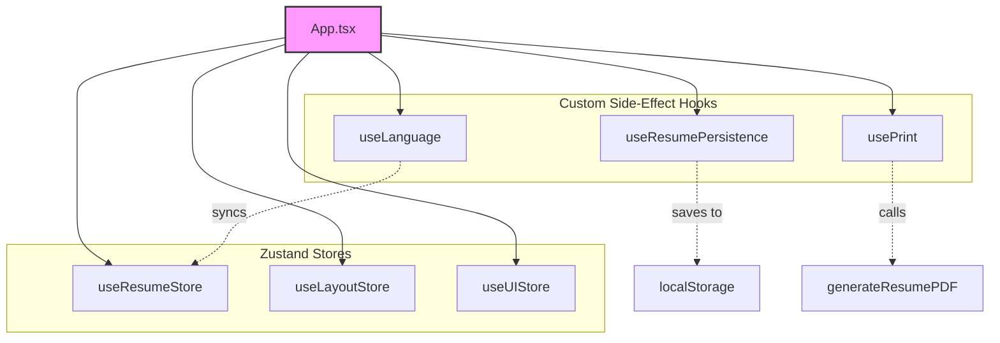
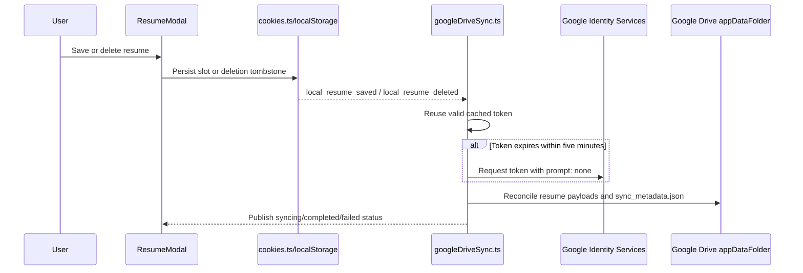

# Architecture Design and Data Flow

This document details the new architectural design, state management layer, custom hooks, and layout flows introduced in the refactoring of the Markdown Resume Generator.

## 🏛️ State Management Architecture

To resolve the complexity of the previous `App.tsx` (which housed multiple independent React state hooks and side-effects), we migrated state to **Zustand** stores located under `src/stores/`. This decouples the core domain state from the visual layout rendering.

### 1. `useResumeStore`
Housed in `src/stores/useResumeStore.ts`, it is the master store containing active CV configurations:
- **Markdown Content**: The active resume draft string.
- **Visual Styles**: Typography, spacing, weights, margins, and custom element styles (`AppStyles`).
- **Layout Templates**: Active CSS layouts (`classic`, `creative`, `minimalist`, etc.).
- **Avoid Page Breaks**: Avoid page split checks and targeting heading levels.
- **Active Language**: Active system and editor language selection (`SupportedLang`).

### 2. `useLayoutStore`
Housed in `src/stores/useLayoutStore.ts`, it manages interface pane sizes and visibility constraints:
- **Sidebar visibility**: Toggles Style configuration panel.
- **Split widths**: Manages left and right pane sizes in pixels dynamically updated by mouse drag resize event listeners.

### 3. `useUIStore`
Housed in `src/stores/useUIStore.ts`, it governs temporal modal status, action loaders, feedback loops:
- **Toasts**: success, error, info notifications.
- **Modals**: Saved CV cookie slots control modal.
- **Tabs**: Active viewport mode (`styles`, `editor`, `preview`) under smaller responsive devices.

---

## 🔗 Custom Side-Effect Hooks

To keep `App.tsx` clean and dedicated solely to rendering layout components, state mutations and background operations are delegated to custom React hooks located under `src/hooks/`:

### 1. `useLanguage`
- Automatically detects user browser local languages and fallback preferences.
- Silent query string URL parameter syncing (`?lang=ja`).
- Modifies dynamic SEO headers (html `lang` attribute, meta descriptions, page title suffixes).
- Resolves default CV boilerplate markups during language switching.

### 2. `useResumePersistence`
- Automatically intercepts store actions and triggers local storage sync operations.
- Preserves the **exact same key schema** (`markdown_resume_content`, `markdown_resume_template`, etc.) to maintain complete backward compatibility for returning users.

### 3. `usePrint`
- Manages exports to Markdown files (`.md`).
- Triggers browser-native print layouts (`window.print()`) that preserve vector structures and full ATS compliance.

---

## ☁️ Google Drive Synchronization

`src/utils/googleDriveSync.ts` owns the Google Identity Services (GIS) authorization flow and synchronization with the Google Drive `appDataFolder`. It subscribes to local resume mutation events at module level, so sync is not tied to whether `ResumeModal` is mounted. `ResumeModal` consumes the status subscription to render connection state, progress, and recoverable errors.

- **Local-first data model:** `cookies.ts` stores full resume payloads and a master metadata list in `localStorage`, then emits `local_resume_saved` or `local_resume_deleted` after a successful mutation. Deletes become timestamped tombstones so they can be propagated instead of returning as zombie items from another device.
- **Conflict resolution:** Sync merges local and remote metadata by resume ID and timestamp. Active records upload/download payloads; newer deletion tombstones remove the corresponding payload and remain in metadata.
- **Token lifecycle:** The access token and absolute expiry timestamp are cached in `localStorage`. A five-minute refresh buffer marks an otherwise valid token as due for renewal; the sync module first calls GIS with `prompt: "none"`, which never opens a popup. Interactive authorization is reserved for an explicit user action such as **Connect Google Drive** or **Sync**. Logout and HTTP 401 responses purge the token cache.
- **Status and recovery:** The module publishes `syncing`, `completed`, `failed`, and `disconnected` transitions to subscribers. A 60-second watchdog aborts stalled requests and exposes a localized error to the modal.
- **Privacy boundary:** There is no application backend. Without user authorization, resume data stays in browser storage; enabled Drive sync sends only the backup records to the user's Google Drive application-data folder.

---

## 📱 Responsive Layout Stacking Flow

When viewport width falls below `1125px`, the layout transitions from a multi-pane side-by-side view to a **mobile-tabbed single-pane view**:
1. Side-by-side pane split width controls and resizing handles are disabled.
2. A sticky mobile navigation tab-bar appears below the header (Tabs: **Styles**, **Editor**, **Preview**).
3. The header action buttons collapse and hide text contents, transforming gracefully into compact icon-only actions on screen sizes under `768px`.
